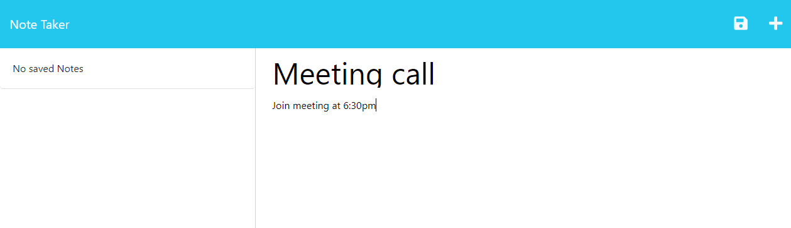

# Note Taker

## Link

https://secret-savannah-57021-0498593e090b.herokuapp.com/

## Description

Note taker is a note taking web app that allows a user to create and save notes that consist of a title and description. The user can also delete saved notes.

The purpose of this project was to familiarise myself with the express web framework. Through this project I had to create routes and fetch 

## Installation

For running locally run the following command:
```
npm i
```

## Usage

Upon going to the link above you will be taken to the homescreen. Click on the "Get Started" button to goto the note page.


Type in a note title and type in some details or a description in the note text section. Then click on the save button in the top right, to save that note. Saved notes will appear on the right side of the screen



Click on a saved note to view it. You can also click on the red bin button next to saved notes to delete that note. To start a new note click on the + button in the top right.


## Credits

N/A

## License

N/A